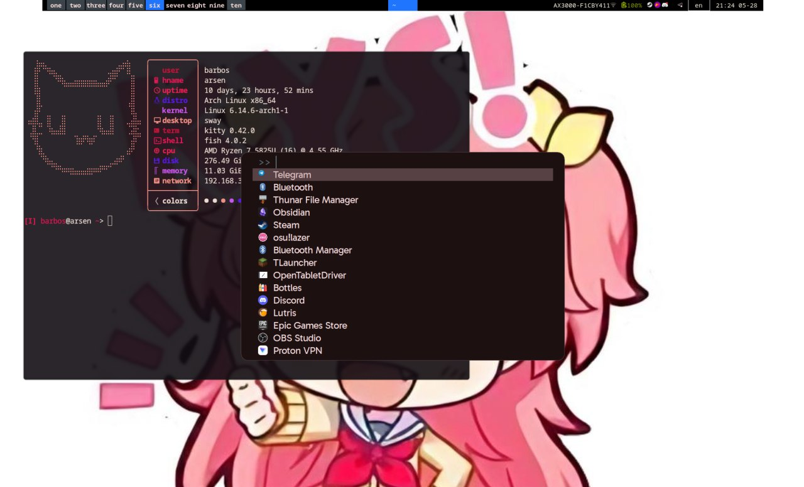

# Dotfiles
It includes my configurations for both sway and hyprland, although I mainly use hyprland now.

Configs are symlinked to ~/.config manually

## Main packages
- Terminal: [kitty](https://sw.kovidgoyal.net/kitty/)
- Shell: [fish](https://fishshell.com/)
- App launcher: [fuzzel](https://codeberg.org/dnkl/fuzzel)
- Editor: [neovim](https://neovim.io/)
- Status Bar: [astal(ags)](https://aylur.github.io/astal/), [waybar](https://github.com/Alexays/Waybar)
- Clipboard manager: [cliphist](https://github.com/sentriz/cliphist)

## Screenshots

